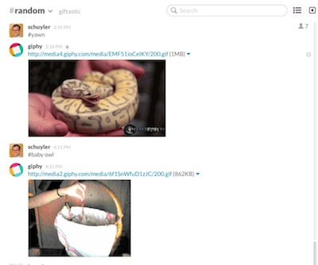

# Gifbot

---

## What?

Gifbot is a lightweight Sinatra app that provides [Slack](http://slack.com/) with embedded keyword search for animated GIFs, using the [Giphy](http://giphy.com/) API, and Slack's webhooks integration. Once setup, you can type `#puppies` in your Slack channel, and Gifbot will post a random animated GIF of adorable puppies to the channel.

---

## Seriously?

Yes.

---

## Why?

What better way to celebrate a teammate's _bon mot_, or to herald a successful code deployment, or announce your imminent departure for lunch?

---

## How?

* Download Gifbot and run `bundle install --path .gems` in the `gifbot` directory. You may need to `sudo gem install bundler` first.

* Set up an outgoing webhook migration in Slack using `http://host:port/gif` as the URL (and substituting the host and port that you'll be running the server on). Slack will give you an application token for this integration; note it. You can use `#` as the default trigger word.

* Edit `gifbot.rb` and set your `SLACK_TOKEN`. You _must_ do this or Gifbot will ignore all attempts to communicate.

* Optionally, set `GIPHY_KEY` to your Giphy key, if you have one. The provided key is Giphy's public beta token and works out of the box, but they like you to [contact them](https://github.com/giphy/GiphyAPI) and ask for a real key if you're using Giphy for serious. You can also change the trigger word and the image style.

* Run `./start_gifbot.sh` on a public webserver, in a screen(1) session or something.

* Type `#kittens` into your Slack chat and voilà.

---

## Are you kidding?

This software took me 20 minutes to write and is released into the public domain. If it breaks, you get to keep _all_ the pieces. Patches welcome, and hugs for everyone.

SDE

__=30=__

